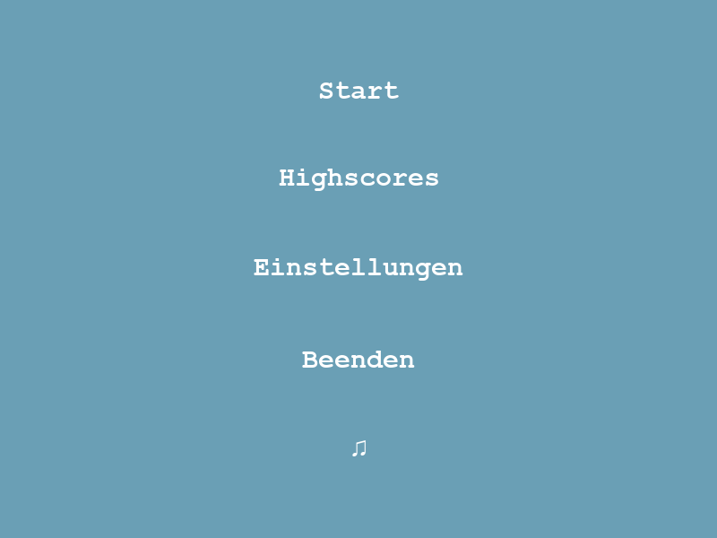
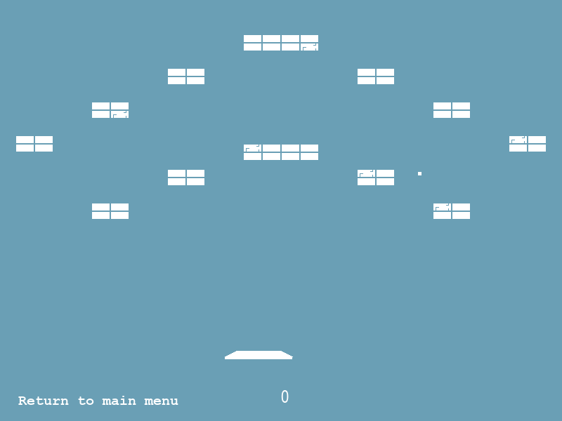
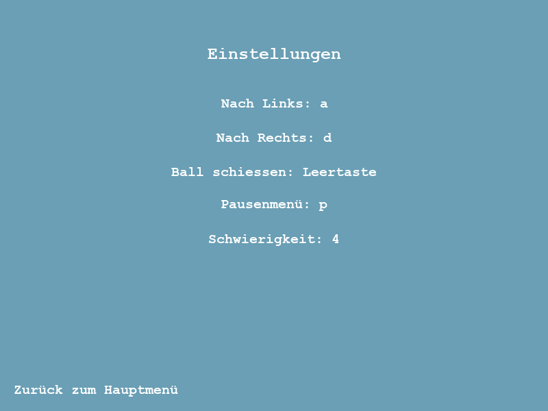

# BrickBreaker
BrickBreaker in Python

BrickBreaker is a Game where you have to destroy blocks by hitting them with a ball. When you've destroyed all the blocks in one Level you move forward

## Some Screenshots

## How to run the game

Download all the .py files and run the main.py file.
