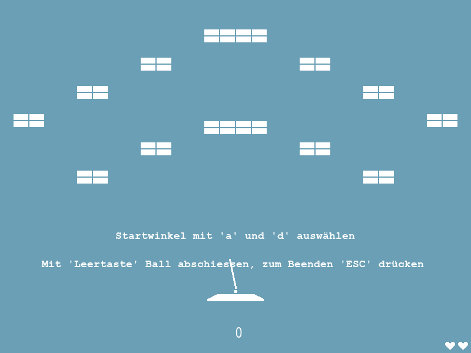
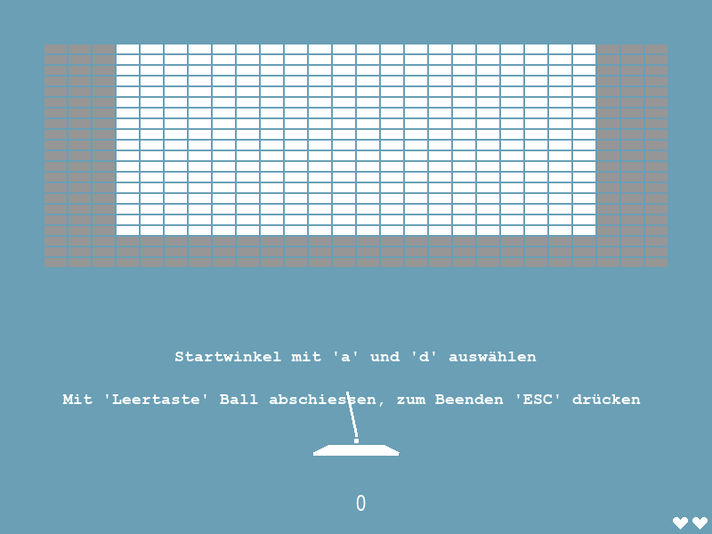

# BrickBreaker
BrickBreaker in Python

BrickBreaker is a Game where you have to destroy blocks by hitting them with a ball. When you've destroyed all the blocks in one Level you move forward to the next Level. When destroying blocks some specials may occur changing the default behaviours of the game.

## Copyright
### Code
(C) by Julian Stein and Jonas Stenger
Where indicated in the source code foreign code or tutorials have been used as reference, kudos to everyone whose code has been used.
  * HighscorePage.py: Pythonian at </dream.in.code> (https://www.dreamincode.net/forums/topic/395940-a-highscore-module-for-pygame/)
  * UIELement.py: programmingpixels on YouTube "Tutorial: How to make a title screen and game buttons with pygame"  (https://www.youtube.com/channel/UCA52UIysqTUBT8-D1N8_8KA) 
### Music
(C) by Simon Kiefer and Julian Stein
    

## Some Screenshots

## How to run the game

First of all install [NumPy](https://numpy.org/install/) and [pygame](https://www.pygame.org/wiki/GettingStarted).

Download all the .py files. This versions is designed for MacOS regarding the default controls' key. 
When using Windows: Go to pages.py --> function game_loop() and exchange the pygame key constants as indicated in commentary lines.
Run the main.py file.
